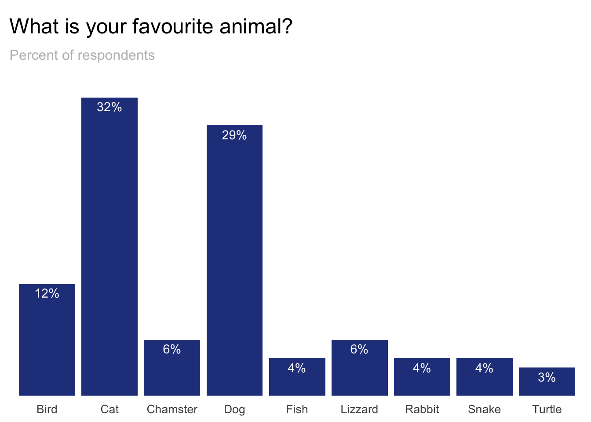
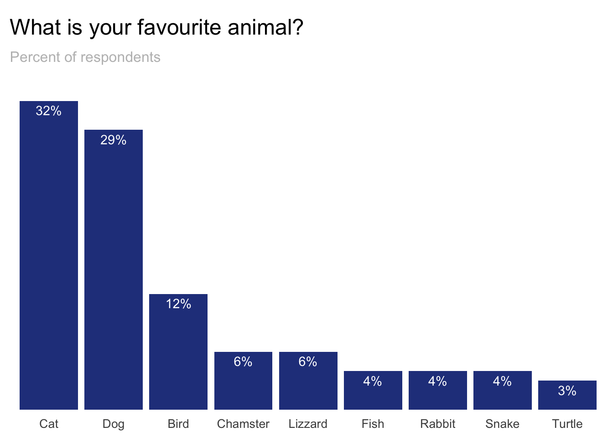
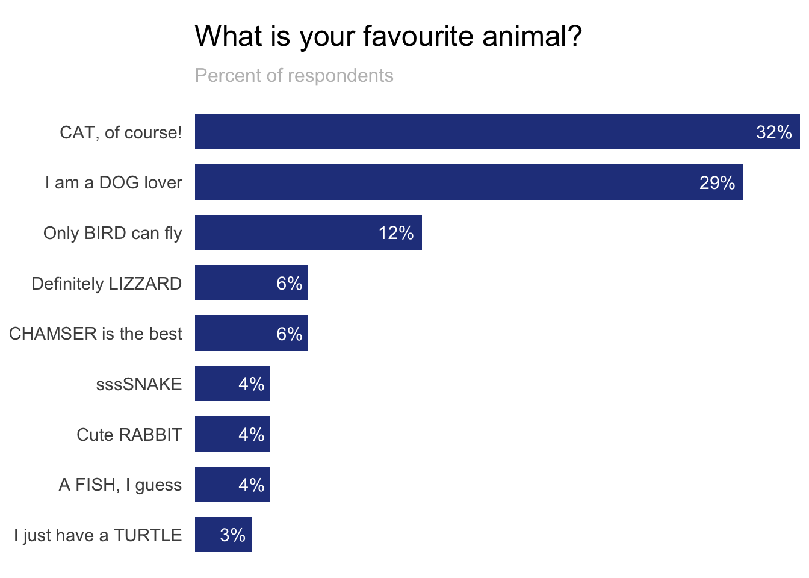
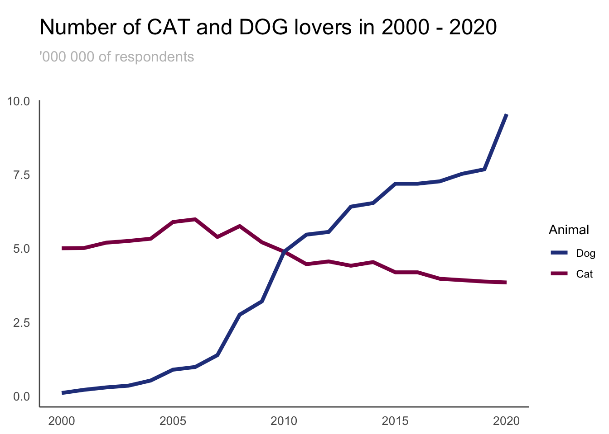
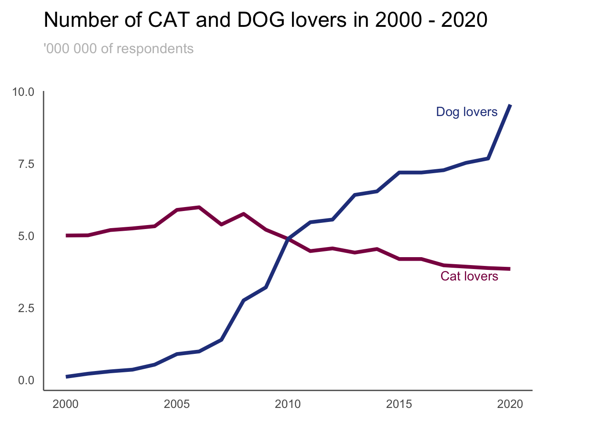

```{r setup, include=FALSE}
# Make sure that you have all the required libraries installed
library(dplyr)
library(ggplot2)
library(magrittr)
library(tidyr)
library(stringr)

#Data prep 
set.seed(50960)
sample_size <- 100

data_categories <- data_frame(
  id = 1:sample_size,
  animal = sample(
    c('Dog', 'Cat', 'Bird', 'Turtle', 'Fish', 'Snake', 'Lizzard', 'Chamster', 'Rabbit'), 
    prob = c(0.35, 0.33, 0.11, 0.1, 0.09, 0.05, 0.05, 0.05, 0.05),
    size = sample_size, 
    replace = TRUE)
)

long_names_dict <- c(
  "Dog" = "I am a DOG lover",
  "Cat" = "CAT, of course!",
  "Bird" = "Only BIRD can fly",
  "Turtle" = "I just have a TURTLE",
  "Fish" = "A FISH, I guess",
  "Snake" = "sssSNAKE",
  "Lizzard" = "Definitely LIZZARD",
  "Chamster" = "CHAMSER is the best",
  "Rabbit" = "Cute RABBIT"
)

data_categories_summarised <- data_categories %>%
  group_by(animal) %>%
  summarise(value = n() / sample_size) %>%
  mutate(animal_long = long_names_dict[animal])

data_time_long <- data_frame(
  year = 2000:2020,
  value_dog = c(101809, 209109, 290782, 349201, 523801, 
                890462, 980924, 1383756, 2752385, 3203816,
                4885342, 5462411, 5554893, 6410382, 6533497,
                7186847, 7186890, 7268162, 7521795, 7673974,
                9543564),
  value_cat = c(5001809, 5009109, 5190782, 5249201, 5323801, 
                5890462, 5980924, 5383756, 5752385, 5203816,
                4885342, 4462411, 4554893, 4410382, 4533497,
                4186847, 4186890, 3968162, 3921795, 3873974,
                3843564)) %>%
  pivot_longer(-year, names_to = "category") %>%
  mutate(label = case_when(
    year == 2020 & category == "value_dog" ~ "Dog lovers",
    year == 2020 & category == "value_cat" ~ "Cat lovers",
    TRUE ~ ""
  ))
```
  
<br />

## Why good data visualisation is important

- Helps understand the data
- Makes it easier to draw conclusions
- Draws attention to what is important in the data
- Makes analysing the data faster (for the audience, once the visual is ready)
- Makes the data easy to digest, especially by the non-analytical audience

  
<br />  
<br />

## Remove unnecessary elements

The plot below presents the default setting of ggplot.  
<br />

```{r barplot_default, echo = FALSE}
# Default settings for bar chart
ggplot(data_categories_summarised, aes(x = animal, y = value)) + 
  geom_col(fill = 'royalblue4') +
  scale_y_continuous(labels = scales::percent_format(accuracy = 1)) +
  labs(title = element_text("What is your favourite animal?")) +
  ylab("Percent of respondents")
```  


{width=75%}  
<br />  
<br /> 

### Your turn! 
Modify the graph in order to create decluttered version.

```{r barplot_decluttered, echo = TRUE}
ggplot(data_categories_summarised, aes(x = animal, y = value)) + 
  geom_col(fill = 'royalblue4') +
  scale_y_continuous(labels = scales::percent_format(accuracy = 1)) +
  labs(title = element_text("What is your favourite animal?")) +
  ylab("Percent of respondents")
```
  
<br />  
<br />

## Choose the proper order of the data categories

General rules for ordering:  
1. Natural order (e.g. time)  
2. Meaningful order (e.g. biggest to smallest brand)  
3. Sorted by value (watch out - in applications that refresh the data often it might be misleading)  
4. Alphabetical 


{width=75%}  
<br />  
<br /> 

### Your turn! 
Modify the graph to order the categories properly.
```{r barplot_order, echo = TRUE}
# Start from the solution to previous task
```
  
<br />  
<br />

## Don’t ask the user to flip their head - flip the graph
  
<br />  
```{r barplot_long_labels, echo = FALSE}
ggplot(data_categories_summarised, aes(x = reorder(animal_long, -value), y = value)) + 
  geom_col(fill = "royalblue4") +
  geom_text(aes(label = scales::percent(value, accuracy = 1)), vjust = 1.5, color = "white", size = 3.8) +
  scale_y_continuous(expand = c(0, 0)) +
  labs(title = "What is your favourite animal?",
       subtitle = "Percent of respondents") +
  theme(
    plot.title = element_text(size = 18, margin = margin(10, 0, 0, 0)),
    plot.subtitle = element_text(size = 12, margin = margin(10, 0, 30, 0), color = "gray"),
    panel.background = element_rect(fill = NA),
    panel.grid.major = element_blank(),
    axis.ticks = element_blank(),
    axis.title = element_blank(),
    axis.text.x = element_text(size = 10, margin = margin(5, 0, 0, 0), angle = 90, hjust = 1),
    axis.text.y = element_blank()
  )
```  
  
<br />
{width=75%}  

<br />  
<br /> 

### Your turn! 
Flip x and y axis.
```{r barplot_labels, echo = TRUE}
ggplot(data_categories_summarised, aes(x = reorder(animal_long, -value), y = value)) + 
  geom_col(fill = "royalblue4") +
  geom_text(aes(label = scales::percent(value, accuracy = 1)), vjust = 1.5, color = "white", size = 3.8) +
  scale_y_continuous(expand = c(0, 0)) +
  labs(title = "What is your favourite animal?",
       subtitle = "Percent of respondents") +
  theme(
    plot.title = element_text(size = 18, margin = margin(10, 0, 0, 0)),
    plot.subtitle = element_text(size = 12, margin = margin(10, 0, 30, 0), color = "gray"),
    panel.background = element_rect(fill = NA),
    panel.grid.major = element_blank(),
    axis.ticks = element_blank(),
    axis.title = element_blank(),
    axis.text.x = element_text(size = 10, margin = margin(5, 0, 0, 0), angle = 90, hjust = 1),
    axis.text.y = element_blank()
  )
```  
  
<br />  
<br />

## Improve a line plot
The graph below shows default settings of a line plot. Decluttering is very similar as for the bar plots.  
<br />  

```{r lineplot_default, echo = FALSE}
ggplot(data_time_long, aes(x = year, y = value / 1000000)) +
  geom_line(aes(color = category)) +
  labs(title = "Number of CAT and DOG lovers in 2000 - 2020") +
  ylab("'000 000 of respondents")
```  
  
<br />
{width=75%}  

<br />  
<br /> 

### Your turn! 
Modify the graph to create decluttered version.
```{r lineplot_decluttered, echo = TRUE}
ggplot(data_time_long, aes(x = year, y = value / 1000000)) +
  geom_line(aes(color = category)) +
  labs(title = "Number of CAT and DOG lovers in 2000 - 2020") +
  ylab("'000 000 of respondents")
``` 
  
<br />  
<br />

## Put labels close to the data
In order to improve the plot even further you can put the labels next to the data.  
<br />
{width=75%} 
<br />  
<br /> 

### Your turn! 
Modify the graph and put labels next to the data.
```{r lineplot_labels, echo = TRUE}
# Start from the solution to previous task
``` 